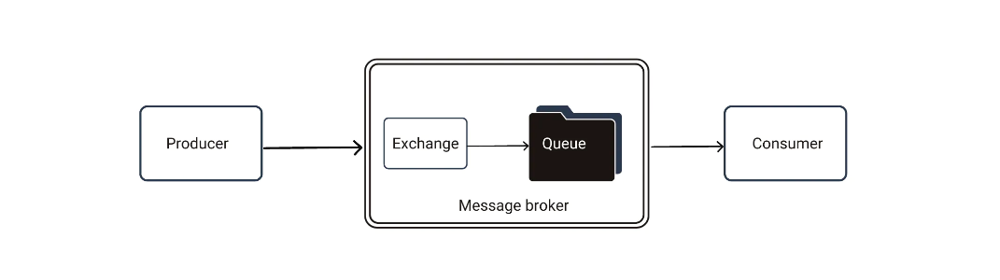

# Microservices-Mern

## Learning to implement microservices in mern

Microservices are usually implemented with docker and Kubernetes.
Skipping that and implementing it in node.js/express.js and mongodb.

## Things to do

* user Service
* product service
* cart service
* nginx for api routing - Using it as a reverse proxy.
* Message broker - For communication between microservices, using rabbitmq.

#### The below diagram explains how message brokers work.

